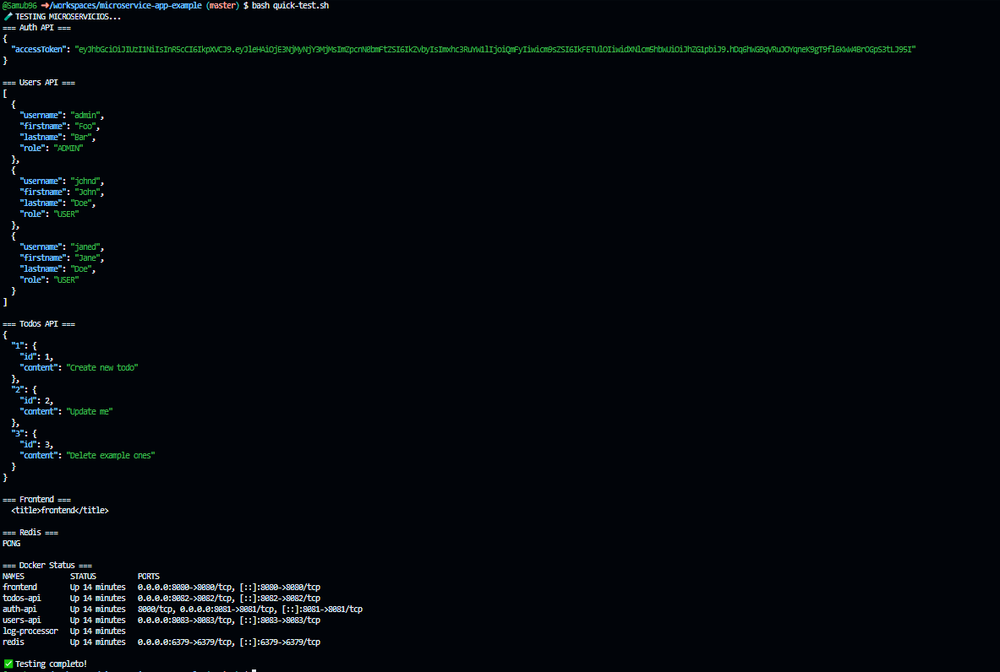

# Dockerizacion y kubernetes de microservicios 


[video](https://youtu.be/8P1VgUeN8lc?si=-OIB0QamVomSVQ9r)

## Estructura del repositorio

```
├── 📁 arch-img
│   └── 🖼️ Microservices.png
├── 📁 auth-api
│   ├── ⚙️ .gitignore
│   ├── 📄 Gopkg.lock
│   ├── ⚙️ Gopkg.toml
│   ├── 📝 README.md
│   ├── 📄 go.mod
│   ├── 📄 go.sum
│   ├── 🐹 main.go
│   ├── 🐹 tracing.go
│   └── 🐹 user.go
├── 📁 doc          <---- Documentacion inicial ----->
│   └── 📝 README.md
├── 📁 dockerfiles  <--- Archivos del taller 1 ----- >
│   ├── ⚙️ docker-compose.yml
│   ├── 📄 dockerfile.authApi
│   ├── 📄 dockerfile.frontend
│   ├── 📄 dockerfile.log-message
│   ├── 📄 dockerfile.todoApi
│   └── 📄 dockerfile.userApi
├── 📁 frontend
│   ├── 📁 config
│   │   ├── 📄 dev.env.js
│   │   ├── 📄 index.js
│   │   └── 📄 prod.env.js
│   ├── 📁 src
│   │   ├── 📁 assets
│   │   │   └── 🖼️ logo.png
│   │   ├── 📁 components
│   │   │   ├── 📁 common
│   │   │   │   └── 📄 Spinner.vue
│   │   │   ├── 📄 App.vue
│   │   │   ├── 📄 AppNav.vue
│   │   │   ├── 📄 Login.vue
│   │   │   ├── 📄 TodoItem.vue
│   │   │   └── 📄 Todos.vue
│   │   ├── 📁 router
│   │   │   └── 📄 index.js
│   │   ├── 📁 store
│   │   │   ├── 📄 index.js
│   │   │   ├── 📄 mutations.js
│   │   │   ├── 📄 plugins.js
│   │   │   └── 📄 state.js
│   │   ├── 📄 auth.js
│   │   ├── 📄 main.js
│   │   └── 📄 zipkin.js
│   ├── 📁 static
│   │   └── ⚙️ .gitkeep
│   ├── ⚙️ .editorconfig
│   ├── ⚙️ .eslintignore
│   ├── 📄 .eslintrc.js
│   ├── ⚙️ .gitignore
│   ├── 📄 .postcssrc.js
│   ├── 📝 README.md
│   ├── 🌐 index.html
│   ├── ⚙️ package-lock.json
│   └── ⚙️ package.json
├── 📁 log-message-processor
│   ├── 📝 README.md
│   ├── 🐍 main.py
│   └── 📄 requirements.txt
├── 📁 todos-api
│   ├── ⚙️ .gitignore
│   ├── 📝 README.md
│   ├── ⚙️ package-lock.json
│   ├── ⚙️ package.json
│   ├── 📄 routes.js
│   ├── 📄 server.js
│   ├── 📄 todoController.js
│   └── 📄 todos-api
├── 📁 users-api
│   ├── 📁 .mvn
│   │   └── 📁 wrapper
│   │       ├── 📄 maven-wrapper.jar
│   │       └── 📄 maven-wrapper.properties
│   ├── 📁 src
│   │   ├── 📁 main
│   │   │   ├── 📁 java
│   │   │   │   └── 📁 com
│   │   │   │       └── 📁 elgris
│   │   │   │           └── 📁 usersapi
│   │   │   │               ├── 📁 api
│   │   │   │               │   └── ☕ UsersController.java
│   │   │   │               ├── 📁 configuration
│   │   │   │               │   └── ☕ SecurityConfiguration.java
│   │   │   │               ├── 📁 models
│   │   │   │               │   ├── ☕ User.java
│   │   │   │               │   └── ☕ UserRole.java
│   │   │   │               ├── 📁 repository
│   │   │   │               │   └── ☕ UserRepository.java
│   │   │   │               ├── 📁 security
│   │   │   │               │   ├── ☕ AccessUserFilter.java
│   │   │   │               │   └── ☕ JwtAuthenticationFilter.java
│   │   │   │               └── ☕ UsersApiApplication.java
│   │   │   └── 📁 resources
│   │   │       ├── 📄 application.properties
│   │   │       └── 📄 data.sql
│   │   └── 📁 test
│   │       └── 📁 java
│   │           └── 📁 com
│   │               └── 📁 elgris
│   │                   └── 📁 usersapi
│   │                       └── ☕ UsersApiApplicationTests.java
│   ├── ⚙️ .gitignore
│   ├── 📝 README.md
│   ├── 📄 mvnw
│   ├── 📄 mvnw.cmd
│   └── ⚙️ pom.xml
├── 📄 LICENSE
├── 📝 README.md
├── 📦 dockerfiles.zip
└── 📄 kubectl.sha256
```
## Resumen de la actividad
 > Taller 1 **Dockerización** 

 El laboratorio consiste en levantar todos los servicios del diagrama en docker garantizando que fuese funcional

 En este caso ya funciona si vamos al directorio de ````dockerfiles```` tenemos los dockerfiles para crear cada servicio de manera manual siguiendo las indicaciones de la documentacion de dicho servicio.


 ```
├── ⚙️ docker-compose.yml
├── 📄 dockerfile.authApi
├── 📄 dockerfile.frontend
├── 📄 dockerfile.log-message
├── 📄 dockerfile.todoApi
└── 📄 dockerfile.userApi
```

 Una vez probado los dockerfiles que fuesen funcionales, migramos a automatizar estos servicios con un docker-compose, donde con solo aplicar el comando ````docker compose up```` se levantarian y se configurarian segun las politicas que el manifiesto tenga

### 🧪 **Verificación y Testing**

Para garantizar que todos los microservicios funcionen correctamente, se creó un script de testing automatizado:

#### **Script de Testing Rápido: `quick-test.sh`**

```bash
# Ejecutar testing completo de la aplicación
bash quick-test.sh
```

**El script verifica:**
- ✅ **Auth API** (Puerto 8081): Login y generación de JWT tokens
- ✅ **Users API** (Puerto 8083): Listado de usuarios con autenticación
- ✅ **Todos API** (Puerto 8082): CRUD de tareas con autenticación JWT
- ✅ **Frontend** (Puerto 8080): Servicio web Vue.js
- ✅ **Redis** (Puerto 6379): Conectividad y sistema de mensajería
- ✅ **Log Processor**: Procesamiento de eventos asíncronos

**Resultado esperado:**
```bash
=== Auth API ===
{
  "accessToken": "eyJhbGciOiJIUzI1NiIsInR5cCI6IkpXVCJ9..."
}

=== Users API ===
[
  {
    "username": "admin",
    "firstname": "Foo",
    "lastname": "Bar",
    "role": "ADMIN"
  }
]

=== Todos API ===
{
  "1": {
    "id": 1,
    "content": "Create new todo"
  }
}
```
**Resultado obtenido:**




 > **PD:** Esto fue testeado en un entorno de codespace de github, para que se pueda ver bien la actividad hay que configurar los port forwarding para que los contenedores puedan comunicarse con los puertos del pc.

  Es totalmente funcional en on-premise
  


 > Taller 2 **Kubernetes** 🚢

Como dijo un filósofo muy famoso:
<p align="center">"Aquí viene lo chido"</p>
<p align="center">-Luisito Comunica-</p>

## 🎯 **Objetivos del Taller Kubernetes**

En la clase de Plataformas 2 estudiamos temas fundamentales de Kubernetes que aplicamos en este proyecto:

1. **Arquitectura Master-Worker Node** - Comprensión de la infraestructura
2. **Despliegue con Minikube** - Entorno local de desarrollo
3. **kubeconfig, Services y Deployments** - Recursos fundamentales
4. **ReplicaSets** - Gestión de réplicas y alta disponibilidad
5. **Networking** - Comunicación entre servicios
6. **ConfigMaps y Secrets** - Gestión de configuración
7. **Autoscaling (HPA)** - Escalado automático basado en métricas
8. **Network Policies** - Seguridad de red micro-segmentada
9. **Monitoring** - Observabilidad con Prometheus y Grafana

### 🎯 **Desafío del Taller**
Desplegar la aplicación completa de microservicios en Kubernetes aplicando **todos los conceptos** estudiados, desde lo básico hasta características avanzadas de producción.

### 🏗️ **Arquitectura Implementada**

```
📦 NAMESPACE: microservices
├── 🎨 Frontend (Vue.js) - LoadBalancer + Ingress
├── ⚙️  APIs Backend  
│   ├── Auth-API (Go) - 8081
│   ├── Users-API (Spring Boot) - 8083
│   └── Todos-API (Node.js) - 8082
├── 🗄️  Database
│   ├── Redis + PVC (1Gi)
│   └── Log-Processor (Python worker)
└── 🔧 Configuración
    ├── ConfigMaps + Secrets
    ├── HPA (Autoescalado 2-4 pods)
    ├── PDB (Garantías disponibilidad)
    └── Network Policies (7 políticas)

📊 NAMESPACE: monitoring
├── Prometheus (métricas)
├── Grafana (dashboards)  
└── ServiceMonitors (4 servicios)
``` 

### 📂 **Manifiestos Kubernetes Implementados**

```
k8s/manifests/
├── 📄 00-namespace.yaml              # Namespace: microservices
├── 📄 01-configmaps.yaml             # ConfigMaps: app-config, redis-config  
├── 📄 02-secrets.yaml                # Secrets: JWT_SECRET
├── 📄 03-redis.yaml                  # Redis: Deployment + Service + PVC (1Gi)
├── 📄 04-users-api.yaml              # Users API: Spring Boot + Service
├── 📄 05-auth-api.yaml               # Auth API: Go + Service + Health checks
├── 📄 06-todos-api.yaml              # Todos API: Node.js + Service
├── 📄 07-log-processor.yaml          # Log Processor: Python worker
├── 📄 08-frontend.yaml               # Frontend: Vue.js + LoadBalancer + Ingress
├── 📄 09-hpa.yaml                    # HPA: 4 autoescaladores (2-4 pods)
├── 📄 10-network-policies.yaml       # Network Policies: 7 políticas seguridad
├── 📄 11-pdb.yaml                    # PDB: 4 Pod Disruption Budgets
├── 📄 12-monitoring.yaml             # ServiceMonitors: 4 monitores Prometheus
├── 📄 13-monitoring-namespace.yaml   # Namespace: monitoring
├── 📄 14-monitoring-config.yaml      # ConfigMaps: Prometheus + Grafana
└── 📄 15-monitoring-stack.yaml       # Stack: Prometheus + Grafana + RBAC
```

**Scripts de Utilidades:**
- 📄 `k8s-test.sh` - Testing automatizado completo
- 📄 `quick-deploy.sh` - Despliegue rápido  
- 📄 `scale-down-dev.sh` - Reducir réplicas para desarrollo

### 🔧 **Características Implementadas**

#### **Autoescalamiento (HPA)**
- ✅ **4 autoescaladores configurados** para auth-api, users-api, todos-api y frontend
- ✅ **Escalamiento 2-4 replicas** basado en CPU (70% target)
- ✅ **Métricas personalizadas** para scaling inteligente

## ⚡ **Configuración de Autoescalado (HPA)**

| Servicio | Min | Max | CPU Target | Memory Target | Comportamiento |
|----------|-----|-----|------------|---------------|---------------|
| **Frontend** | 2 | 4 | 60% | 70% | ScaleUp: 50%, ScaleDown: 25% |
| **Auth-API** | 2 | 4 | 70% | 80% | ScaleUp: 100%, ScaleDown: 50% |
| **Users-API** | 2 | 4 | 70% | 80% | ScaleUp: 100%, ScaleDown: 50% |
| **Todos-API** | 2 | 4 | 70% | 80% | ScaleUp: 100%, ScaleDown: 50% |

#### **Monitoreo y Observabilidad**
- ✅ **Prometheus v2.40.0** para recolección de métricas
- ✅ **Grafana v9.0.0** para visualización de dashboards
- ✅ **4 ServiceMonitors** configurados para scraping automático
- ✅ **Health checks** en todos los servicios
- ✅ **RBAC completo** para acceso seguro a métricas

#### **Seguridad de Red**
- ✅ **7 Network Policies** implementadas:
  - Default deny para todo el tráfico
  - Políticas específicas por servicio
  - Microsegmentación entre componentes
  - Acceso controlado a Redis y servicios externos

#### **Alta Disponibilidad**
- ✅ **4 Pod Disruption Budgets** (PDB) configurados
- ✅ **Persistent Volume Claims** para Redis (1Gi)
- ✅ **Health checks** y **readiness probes**
- ✅ **LoadBalancer** para frontend con múltiples réplicas

#### **Gestión de Configuración**
- ✅ **ConfigMaps centralizados** para configuraciones
- ✅ **Secrets** para credenciales JWT y bases de datos
- ✅ **Variables de entorno** organizadas por servicio
- ✅ **Kustomize** para personalización de entornos

### 🚀 **Despliegue Rápido**

#### **Opción 1: Despliegue Básico**
```bash
# Ir al directorio k8s y aplicar manifiestos
cd k8s
kubectl apply -k manifests/

# Verificar despliegue
kubectl get pods -n microservices
kubectl get pods -n monitoring
```

#### **Opción 2: Testing Automatizado**
```bash
# Script completo con verificación de todos los servicios
bash k8s-test.sh

# Resultado esperado: ✅ para todos los componentes
# ✅ Auth API (login y JWT)
# ✅ Users API (listado con autenticación)  
# ✅ Todos API (CRUD operaciones)
# ✅ Redis (conectividad)
# ✅ Prometheus (métricas)
# ✅ Grafana (dashboards)
```

### 📊 **Acceso a Servicios**

#### **Port Forwarding para Desarrollo:**
```bash
# Frontend (aplicación principal)
kubectl port-forward svc/frontend 8080:8080 -n microservices

# Grafana (dashboards de monitoreo)
kubectl port-forward svc/grafana 3000:3000 -n monitoring

# Prometheus (métricas raw)
kubectl port-forward svc/prometheus 9090:9090 -n monitoring
```

#### **Credenciales de Acceso:**
- **Grafana**: usuario `admin`, password `admin123`
- **Auth API**: usuario `admin`, password `admin` 
- **Prometheus**: sin autenticación requerida

### 🧪 **Testing y Verificación**

#### **Script de Testing Automatizado: `k8s-test.sh`**
```bash
# Ejecutar testing completo de la aplicación K8s
bash k8s/k8s-test.sh
```

**El script verifica:**
- ✅ **Conectividad básica** a todos los servicios
- ✅ **Auth API**: Login de usuario y generación JWT
- ✅ **Users API**: Listado de usuarios con token de autorización
- ✅ **Todos API**: Operaciones CRUD (crear, leer todos)
- ✅ **Redis**: Conectividad y funcionamiento
- ✅ **Prometheus**: API de métricas y targets
- ✅ **Grafana**: API de dashboards y datasources
- ✅ **HPA**: Verificación de autoescaladores
- ✅ **Network Policies**: Políticas de seguridad activas

#### **Comandos Útiles para Debugging:**
```bash
# Ver el estado de todos los pods
kubectl get pods -n microservices
kubectl get pods -n monitoring

# Revisar logs de un servicio específico
kubectl logs -f deployment/auth-api -n microservices
kubectl logs -f deployment/prometheus -n monitoring

# Verificar HPA funcionando
kubectl get hpa -n microservices -w

# Estado de Network Policies
kubectl get networkpolicy -n microservices

# Verificar PersistentVolumes
kubectl get pv,pvc -n microservices
```

---

## 🎯 **Cumplimiento de Objetivos de Aprendizaje**

### ✅ **Conceptos Kubernetes Aplicados:**

1. **Pods y Deployments** - Todos los microservicios desplegados correctamente
2. **Services** - Comunicación interna y externa configurada
3. **ConfigMaps y Secrets** - Gestión de configuraciones y credenciales
4. **Persistent Volumes** - Almacenamiento persistente para Redis
5. **Horizontal Pod Autoscaler** - Autoescalado basado en CPU implementado
6. **Network Policies** - Microsegmentación de red con 7 políticas
7. **Monitoring** - Stack Prometheus/Grafana completamente funcional
8. **Namespaces** - Separación lógica entre aplicación y monitoreo
9. **Ingress** - Acceso externo al frontend
10. **Pod Disruption Budgets** - Garantías de alta disponibilidad

# Ver logs de aplicación
kubectl logs -f deployment/todos-api -n microservices

# Verificar network policies
kubectl describe networkpolicy -n microservices


### 🔧 **Arquitectura de Kubernetes**


```
┌─────────────────────────────────────────────────────────┐
│                    INGRESS CONTROLLER                  │
└─────────────────────┬───────────────────────────────────┘
                      │
┌─────────────────────▼───────────────────────────────────┐
│                   FRONTEND                              │
│                 (LoadBalancer)                          │
└─────────────────┬───────────────┬───────────────────────┘
                  │               │
      ┌───────────▼──────────┐   ┌▼────────────────┐
      │     AUTH-API         │   │   TODOS-API     │
      │   (ClusterIP)        │   │  (ClusterIP)    │
      └───────────┬──────────┘   └┬────────────────┘
                  │               │
      ┌───────────▼──────────┐   ┌▼────────────────┐
      │    USERS-API         │   │     REDIS       │
      │   (ClusterIP)        │   │  (ClusterIP)    │
      └──────────────────────┘   └┬────────────────┘
                                  │
                      ┌───────────▼──────────┐
                      │   LOG-PROCESSOR      │
                      │   (No Service)       │
                      └──────────────────────┘
```

### 📈 **Escalabilidad y Performance**

- **HPA configurado** para todos los servicios críticos
- **Resource limits** optimizados por tipo de servicio
- **Network policies** para seguridad micro-segmentada
- **Persistent volumes** para datos críticos
- **Rolling updates** sin downtime

### 🎯 **Resultados Esperados**

Al completar el despliegue deberías tener:

✅ **6 microservicios funcionando** en el namespace `microservices`  
✅ **Stack de monitoreo completo** en el namespace `monitoring`  
✅ **Autoescalado configurado** respondiendo a métricas  
✅ **Red segura** con políticas granulares  
✅ **Dashboards operativos** con métricas en tiempo real  
✅ **Testing automatizado** verificando funcionalidad  


 
 