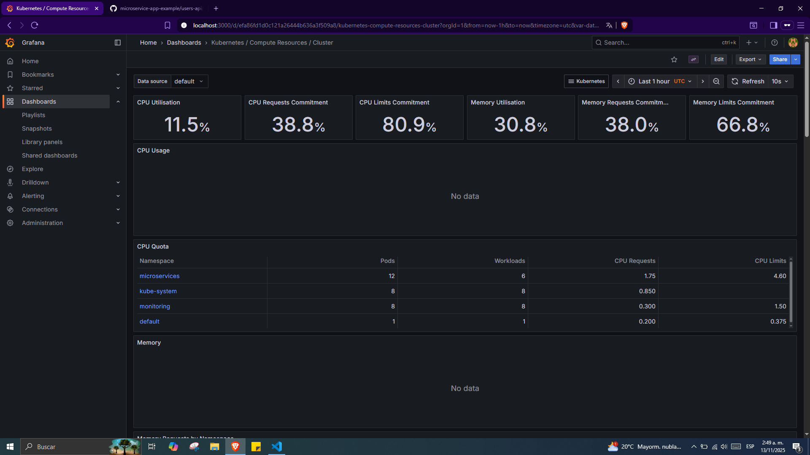

# Dockerizacion y kubernetes de microservicios 


## Estructura del repositorio

```
├── 📁 arch-img
│   └── 🖼️ Microservices.png
├── 📁 auth-api
│   ├── ⚙️ .gitignore
│   ├── 📄 Gopkg.lock
│   ├── ⚙️ Gopkg.toml
│   ├── 📝 README.md
│   ├── 📄 go.mod
│   ├── 📄 go.sum
│   ├── 🐹 main.go
│   ├── 🐹 tracing.go
│   └── 🐹 user.go
├── 📁 doc          <---- Documentacion inicial ----->
│   └── 📝 README.md
├── 📁 dockerfiles  <--- Archivos del taller 1 ----- >
│   ├── ⚙️ docker-compose.yml
│   ├── 📄 dockerfile.authApi
│   ├── 📄 dockerfile.frontend
│   ├── 📄 dockerfile.log-message
│   ├── 📄 dockerfile.todoApi
│   └── 📄 dockerfile.userApi
├── 📁 frontend
│   ├── 📁 config
│   │   ├── 📄 dev.env.js
│   │   ├── 📄 index.js
│   │   └── 📄 prod.env.js
│   ├── 📁 src
│   │   ├── 📁 assets
│   │   │   └── 🖼️ logo.png
│   │   ├── 📁 components
│   │   │   ├── 📁 common
│   │   │   │   └── 📄 Spinner.vue
│   │   │   ├── 📄 App.vue
│   │   │   ├── 📄 AppNav.vue
│   │   │   ├── 📄 Login.vue
│   │   │   ├── 📄 TodoItem.vue
│   │   │   └── 📄 Todos.vue
│   │   ├── 📁 router
│   │   │   └── 📄 index.js
│   │   ├── 📁 store
│   │   │   ├── 📄 index.js
│   │   │   ├── 📄 mutations.js
│   │   │   ├── 📄 plugins.js
│   │   │   └── 📄 state.js
│   │   ├── 📄 auth.js
│   │   ├── 📄 main.js
│   │   └── 📄 zipkin.js
│   ├── 📁 static
│   │   └── ⚙️ .gitkeep
│   ├── ⚙️ .editorconfig
│   ├── ⚙️ .eslintignore
│   ├── 📄 .eslintrc.js
│   ├── ⚙️ .gitignore
│   ├── 📄 .postcssrc.js
│   ├── 📝 README.md
│   ├── 🌐 index.html
│   ├── ⚙️ package-lock.json
│   └── ⚙️ package.json
├── 📁 log-message-processor
│   ├── 📝 README.md
│   ├── 🐍 main.py
│   └── 📄 requirements.txt
├── 📁 todos-api
│   ├── ⚙️ .gitignore
│   ├── 📝 README.md
│   ├── ⚙️ package-lock.json
│   ├── ⚙️ package.json
│   ├── 📄 routes.js
│   ├── 📄 server.js
│   ├── 📄 todoController.js
│   └── 📄 todos-api
├── 📁 users-api
│   ├── 📁 .mvn
│   │   └── 📁 wrapper
│   │       ├── 📄 maven-wrapper.jar
│   │       └── 📄 maven-wrapper.properties
│   ├── 📁 src
│   │   ├── 📁 main
│   │   │   ├── 📁 java
│   │   │   │   └── 📁 com
│   │   │   │       └── 📁 elgris
│   │   │   │           └── 📁 usersapi
│   │   │   │               ├── 📁 api
│   │   │   │               │   └── ☕ UsersController.java
│   │   │   │               ├── 📁 configuration
│   │   │   │               │   └── ☕ SecurityConfiguration.java
│   │   │   │               ├── 📁 models
│   │   │   │               │   ├── ☕ User.java
│   │   │   │               │   └── ☕ UserRole.java
│   │   │   │               ├── 📁 repository
│   │   │   │               │   └── ☕ UserRepository.java
│   │   │   │               ├── 📁 security
│   │   │   │               │   ├── ☕ AccessUserFilter.java
│   │   │   │               │   └── ☕ JwtAuthenticationFilter.java
│   │   │   │               └── ☕ UsersApiApplication.java
│   │   │   └── 📁 resources
│   │   │       ├── 📄 application.properties
│   │   │       └── 📄 data.sql
│   │   └── 📁 test
│   │       └── 📁 java
│   │           └── 📁 com
│   │               └── 📁 elgris
│   │                   └── 📁 usersapi
│   │                       └── ☕ UsersApiApplicationTests.java
│   ├── ⚙️ .gitignore
│   ├── 📝 README.md
│   ├── 📄 mvnw
│   ├── 📄 mvnw.cmd
│   └── ⚙️ pom.xml
├── 📄 LICENSE
├── 📝 README.md
├── 📦 dockerfiles.zip
└── 📄 kubectl.sha256
```
## Resumen de la actividad
 > Taller 1 **Dockerización** 

 El laboratorio consiste en levantar todos los servicios del diagrama en docker garantizando que fuese funcional

 En este caso ya funciona si vamos al directorio de ````dockerfiles```` tenemos los dockerfiles para crear cada servicio de manera manual siguiendo las indicaciones de la documentacion de dicho servicio.


 ```
├── ⚙️ docker-compose.yml
├── 📄 dockerfile.authApi
├── 📄 dockerfile.frontend
├── 📄 dockerfile.log-message
├── 📄 dockerfile.todoApi
└── 📄 dockerfile.userApi
```

 Una vez probado los dockerfiles que fuesen funcionales, migramos a automatizar estos servicios con un docker-compose, donde con solo aplicar el comando ````docker compose up```` se levantarian y se configurarian segun las politicas que el manifiesto tenga

### 🧪 **Verificación y Testing**

Para garantizar que todos los microservicios funcionen correctamente, se creó un script de testing automatizado:

#### **Script de Testing Rápido: `quick-test.sh`**

```bash
# Ejecutar testing completo de la aplicación
bash quick-test.sh
```

**El script verifica:**
- ✅ **Auth API** (Puerto 8081): Login y generación de JWT tokens
- ✅ **Users API** (Puerto 8083): Listado de usuarios con autenticación
- ✅ **Todos API** (Puerto 8082): CRUD de tareas con autenticación JWT
- ✅ **Frontend** (Puerto 8080): Servicio web Vue.js
- ✅ **Redis** (Puerto 6379): Conectividad y sistema de mensajería
- ✅ **Log Processor**: Procesamiento de eventos asíncronos

**Resultado esperado:**
```bash
=== Auth API ===
{
  "accessToken": "eyJhbGciOiJIUzI1NiIsInR5cCI6IkpXVCJ9..."
}

=== Users API ===
[
  {
    "username": "admin",
    "firstname": "Foo",
    "lastname": "Bar",
    "role": "ADMIN"
  }
]

=== Todos API ===
{
  "1": {
    "id": 1,
    "content": "Create new todo"
  }
}
```
**Resultado obtenido:**




 > **PD:** Esto fue testeado en un entorno de codespace de github, para que se pueda ver bien la actividad hay que configurar los port forwarding para que los contenedores puedan comunicarse con los puertos del pc.

  Es totalmente funcional en on-premise
  


 > Taller 2 **Kubernetes**

 Como dijo un filosofo muy famoso 
 <p align="center">"Aqui viene lo chido"</p>
<p align="center">  -Luisito comunica-</p>

En la clase de Plataformas 2 vimos temas de kubernetes importantes como 

 1. Arquitectura master node - worker node
 2. Despliegue con minikube
 3. kubeconfig, services and deployments
 4. Replicaset
 5. Networking
 6. configmaps and secrets
 7. Autoscaling
 8. network policies
 9. monitoring 
 
 Entonces como consiste la actividad? 

 El taller consta de desplegar los microservicios en kubernetes aplicando los temas que vimos 

### 📁 **Estructura del Directorio K8s**

```
k8s/
├── 📁 manifests/
│   ├── 📄 00-namespace.yaml              # Namespace principal
│   ├── 📄 01-configmaps.yaml             # Configuraciones centralizadas
│   ├── 📄 02-secrets.yaml                # Secretos y credenciales
│   ├── 📄 03-redis.yaml                  # Base de datos Redis
│   ├── 📄 04-users-api.yaml              # API de usuarios (Spring Boot)
│   ├── 📄 05-auth-api.yaml               # API de autenticación (Go)
│   ├── 📄 06-todos-api.yaml              # API de tareas (Node.js)
│   ├── 📄 07-log-processor.yaml          # Procesador de logs (Python)
│   ├── 📄 08-frontend.yaml               # Frontend web (Vue.js)
│   ├── 📄 09-hpa.yaml                    # Horizontal Pod Autoscaler
│   ├── 📄 10-network-policies.yaml       # Políticas de red
│   ├── 📄 11-pdb.yaml                    # Pod Disruption Budget
│   ├── 📄 12-monitoring.yaml             # Service Monitors
│   ├── 📄 13-monitoring-namespace.yaml   # Namespace de monitoreo
│   ├── 📄 14-monitoring-config.yaml      # Configuración Prometheus/Grafana
│   ├── 📄 15-monitoring-stack.yaml       # Stack completo de monitoreo
│   └── 📄 kustomization.yaml             # Kustomize configuration
├── 📄 deploy.sh                          # Script de despliegue básico
├── 📄 deploy-cd.sh                       # Pipeline CI/CD avanzado
├── 📄 cleanup.sh                         # Script de limpieza
└── 📝 README.md                          # Documentación detallada
```

### 🚀 **Características Implementadas**

#### **✅ Cumplimiento de Rúbrica Básica:**

1. **🐳 Docker**: Aplicación completamente dockerizada y funcional
2. **🌐 Networking**: 
   - Services para comunicación interna
   - Ingress para acceso externo
   - Network Policies con principio de menor privilegio
3. **📈 HPA (Horizontal Pod Autoscaler)**:
   - Métricas de CPU y memoria
   - Políticas de escalado personalizadas
   - Escalado automático por servicio
4. **🔐 Secrets**: 
   - JWT tokens seguros
   - Credenciales de base de datos
   - Configuraciones sensibles
5. **🚀 CD (Continuous Deployment)**:
   - Pipeline automatizado
   - Estrategias: Rolling, Blue-Green, Recreate
   - Health checks y rollback automático
6. **📊 Monitoring**: 
   - Stack completo Prometheus + Grafana
   - Métricas de aplicación y sistema
   - Dashboards personalizados
   - Alertas configuradas
7. **📖 Docs**: Documentación completa
8. **🎥 Demostración**: Scripts de testing automatizados

#### **🏆 Mejoras Plus Implementadas:**

- **🛡️ Security Hardening**: Pod Security Standards, Service Accounts
- **🏥 Advanced Health Checks**: Startup, Readiness, Liveness probes
- **📦 Pod Disruption Budgets**: Garantía de disponibilidad
- **🔧 Resource Management**: Requests y limits optimizados
- **🎚️ Multiple Deployment Strategies**: Rolling, Blue-Green
- **📈 Advanced Monitoring**: Alertas y métricas custom

### 🚀 **Despliegue Rápido**

#### **Opción 1: Despliegue Básico**
```bash
# Ir al directorio k8s
cd k8s

# Despliegue simple
./deploy.sh
```

#### **Opción 2: Pipeline CI/CD Avanzado**
```bash
# Despliegue con Rolling Update (default)
./deploy-cd.sh deploy

# Despliegue Blue-Green
./deploy-cd.sh deploy blue-green

# Despliegue Recreate
./deploy-cd.sh deploy recreate

# Rollback en caso de problemas
./deploy-cd.sh rollback

# Limpieza completa
./deploy-cd.sh cleanup
```

#### **Opción 3: Usando Kustomize**
```bash
# Aplicar todos los manifiestos
kubectl apply -k manifests/

# Verificar despliegue
kubectl get all -n microservices
kubectl get all -n monitoring
```

### 📊 **Monitoreo y Observabilidad**

#### **Acceso a Dashboards:**
```bash
# Grafana (usuario: admin, password: admin123)
kubectl port-forward svc/grafana 3000:3000 -n monitoring

# Prometheus
kubectl port-forward svc/prometheus 9090:9090 -n monitoring

# Aplicación
kubectl port-forward svc/frontend 8080:8080 -n microservices
```

#### **Métricas Disponibles:**
- **Kubernetes**: Pods, deployments, recursos
- **Aplicación**: Request rate, latency, errors
- **Sistema**: CPU, memoria, red, almacenamiento
- **Redis**: Conectividad, comandos, memoria

#### **Alertas Configuradas:**
- Pod crash looping
- Alto uso de CPU/memoria
- Servicios caídos
- Errores de aplicación

### 🧪 **Testing y Verificación**

```bash
# Testing completo de la aplicación K8s
kubectl port-forward svc/frontend 8080:8080 -n microservices &
bash ../quick-test.sh

# Verificar HPA funcionando
kubectl get hpa -n microservices -w

# Ver logs de aplicación
kubectl logs -f deployment/todos-api -n microservices

# Verificar network policies
kubectl describe networkpolicy -n microservices
```

### 🔧 **Arquitectura de Kubernetes**

```
┌─────────────────────────────────────────────────────────┐
│                    INGRESS CONTROLLER                  │
└─────────────────────┬───────────────────────────────────┘
                      │
┌─────────────────────▼───────────────────────────────────┐
│                   FRONTEND                              │
│                 (LoadBalancer)                          │
└─────────────────┬───────────────┬───────────────────────┘
                  │               │
      ┌───────────▼──────────┐   ┌▼────────────────┐
      │     AUTH-API         │   │   TODOS-API     │
      │   (ClusterIP)        │   │  (ClusterIP)    │
      └───────────┬──────────┘   └┬────────────────┘
                  │               │
      ┌───────────▼──────────┐   ┌▼────────────────┐
      │    USERS-API         │   │     REDIS       │
      │   (ClusterIP)        │   │  (ClusterIP)    │
      └──────────────────────┘   └┬────────────────┘
                                  │
                      ┌───────────▼──────────┐
                      │   LOG-PROCESSOR      │
                      │   (No Service)       │
                      └──────────────────────┘
```

### 📈 **Escalabilidad y Performance**

- **HPA configurado** para todos los servicios críticos
- **Resource limits** optimizados por tipo de servicio
- **Network policies** para seguridad micro-segmentada
- **Persistent volumes** para datos críticos
- **Rolling updates** sin downtime

### 🎯 **Resultados Esperados**

Al completar el despliegue deberías tener:

✅ **6 microservicios funcionando** en el namespace `microservices`  
✅ **Stack de monitoreo completo** en el namespace `monitoring`  
✅ **Autoescalado configurado** respondiendo a métricas  
✅ **Red segura** con políticas granulares  
✅ **Dashboards operativos** con métricas en tiempo real  
✅ **Pipeline CI/CD** con múltiples estrategias  
✅ **Testing automatizado** verificando funcionalidad  

Para mayor detalle buscar en la carpeta ````/k8s/README.md````


 
 